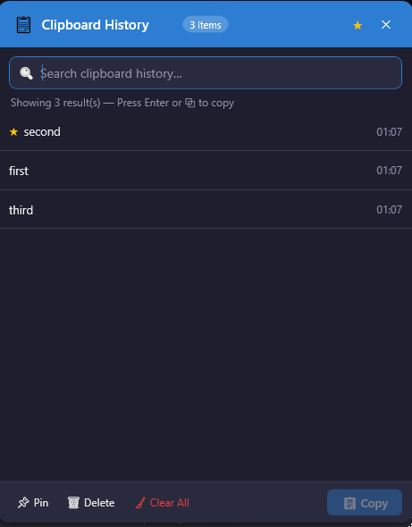

# Clipboard Manager

[](https://github.com/GetGabed/Clipboard-Manager/actions/workflows/ci.yml)
[](https://github.com/GetGabed/Clipboard-Manager/releases/latest)
[](LICENSE)
[](#testing)
[](CHANGELOG.md)

A lightweight, high-performance Windows system-tray application that captures and stores your clipboard history — text, images, and files.

---

## Features

- 📋 **Auto-capture** — text, image, and file clipboard events recorded instantly
- 🔍 **Instant search** — fuzzy-filter across the full history as you type
- 📌 **Pin items** — prevent pinned entries from being evicted
- 🔄 **Text transforms** — 14 one-click transforms (UPPER, lower, Title, URL-encode, Base64, …)
- ⌨️ **Rebindable global hotkey** — default `Ctrl+Shift+V`, change it live in Settings
- 🖱️ **Right-click context menu** — Copy / Pin / Transform / Delete without lifting your hands
- 🌙 **Dark mode** — live toggle in Settings (no restart required); also activates on system High Contrast
- 🔒 **Encrypted history** — `history.json` protected with Windows DPAPI (current-user scope)
- �️ **Excluded-app list** — silently skip capture from password managers and other sensitive apps (configurable)
- 🔒 **Sensitive-content badge** — items matching password/token/key patterns are visually flagged
- ⏱️ **Auto-expire** — unpinned items older than N days are automatically removed (configurable)
- 📊 **Copy frequency tracking** — tracks how often each item is re-used across sessions
- 📝 **Structured logging** — rolling log file at `%APPDATA%\ClipboardManager\logs\app-.log`; clipboard content is never written
- 🗑️ **Per-item delete** and bulk **Clear Unpinned**
- ⚙️ **Settings** — max history, auto-expire, exclude apps, start-with-Windows, dark mode, hotkey, disk persistence
- 💾 **Optional persistence** — history survives restarts via `%APPDATA%\ClipboardManager`
- 🚀 **Low footprint** — ~73 MB self-contained single EXE, targets < 500 ms startup

---

## Screenshots




---

## Download

Grab the latest portable ZIP or installer from the [Releases](https://github.com/GetGabed/Clipboard-Manager/releases/latest) page.

| Artifact | Description |
|---|---|
| `ClipboardManager-portable-vX.Y.Z.zip` | Extract anywhere and run — no install required |

**Requirements:** Windows 10 / 11 (x64). No .NET runtime required — the EXE is self-contained.

---

## Keyboard Shortcuts

| Shortcut | Action |
|---|---|
| `Ctrl + Shift + V` | Open / close the history window (default; rebindable in Settings) |
| `Tab` | Navigate: Search → List → Pin → Delete → Clear → Copy |
| `Enter` | Copy the selected item to clipboard |
| `Space` | Toggle full-size preview (image items) |
| `Delete` | Delete the selected item |
| `Escape` | Close the history window |
| Right-click on item | Context menu: Copy / Pin-Unpin / Transform / Delete |

---

## Building from Source

### Prerequisites

| Tool | Version |
|---|---|
| Windows | 10 or 11 |
| [.NET 8 SDK](https://dotnet.microsoft.com/download/dotnet/8.0) | 8.0.x |
| Git | any recent version |

### Clone, build, and run

```powershell
git clone https://github.com/GetGabed/Clipboard-Manager.git
cd Clipboard-Manager
dotnet restore
dotnet build
dotnet run --project src\ClipboardManager
```

### Run tests

```powershell
dotnet test
```

### Publish a self-contained EXE

```powershell
dotnet publish src\ClipboardManager -c Release -r win-x64 --self-contained true `
  /p:PublishSingleFile=true -o publish\win-x64
```

### Full release pipeline (tests → publish → portable ZIP)

```powershell
.\scripts\release.ps1
# Optional flags:
#   -SkipTests      skip dotnet test
#   -SkipInstaller  skip Inno Setup step
```

---

## Testing

Tests are in `tests/ClipboardManager.Tests/` and run with:

```powershell
dotnet test
```

### Coverage by layer (testable units, v0.9.0)

| Layer | Class | Line Coverage |
|---|---|---|
| Helpers | `CircularBuffer<T>` | 93% |
| Helpers | `TextTransformHelper` | 100% |
| Models | `AppSettings` | 100% |
| Models | `ClipboardItem` | 79% |
| Services | `ClipboardStorageService` | 71% |
| Services | `HistoryPersistenceService` | 83% |
| Services | `SettingsService` | 90% |
| ViewModels | `BaseViewModel` | 100% |

> **Note:** WPF views, Win32 hooks (`ClipboardMonitorService`, `HotkeyService`), and XAML converters are excluded from unit coverage — they require a live WPF runtime.

To regenerate the HTML coverage report:

```powershell
dotnet test --collect:"XPlat Code Coverage" --results-directory ./coverage
reportgenerator -reports:"coverage/**/coverage.cobertura.xml" -targetdir:"coverage/report" -reporttypes:Html
```

---

## Project Structure

```
src/ClipboardManager/
├── Models/          – ClipboardItem, AppSettings
├── ViewModels/      – HistoryViewModel, SettingsViewModel (MVVM)
├── Views/           – HistoryWindow, SettingsWindow (WPF)
├── Services/        – ClipboardMonitorService, HotkeyService, SettingsService,
│                      HistoryPersistenceService
├── Helpers/         – RelayCommand, CircularBuffer<T>, TextTransformHelper,
│                      StartupHelper, TimestampConverter
└── Resources/       – Styles (Theme.xaml, DarkColors.xaml), Icons
tests/
└── ClipboardManager.Tests/   – 99 xUnit unit tests
installer/
└── ClipboardManager.iss      – Inno Setup 6 installer script
scripts/
├── release.ps1               – full release pipeline
└── build-portable.ps1        – builds portable ZIP only
```

---

## Contributing

Contributions are welcome! Please read [CONTRIBUTING.md](CONTRIBUTING.md) before opening a pull request.

Quick checklist:
- Branch from `main` using `feature/`, `fix/`, or `chore/` prefix
- `dotnet build -c Release` must produce zero warnings
- All existing tests must pass; add tests for new logic where feasible
- Update this README if your change affects user-visible behaviour

For security issues see [SECURITY.md](SECURITY.md).  
For feature ideas or bug reports use the [GitHub Issues](https://github.com/GetGabed/Clipboard-Manager/issues) templates.

---

## Licence

[MIT](LICENSE) © Gabriel Dubois